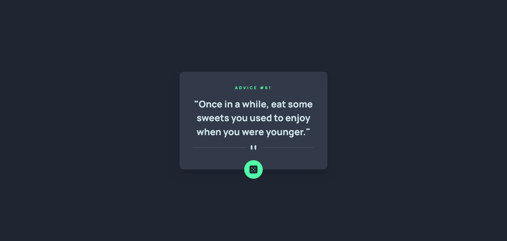
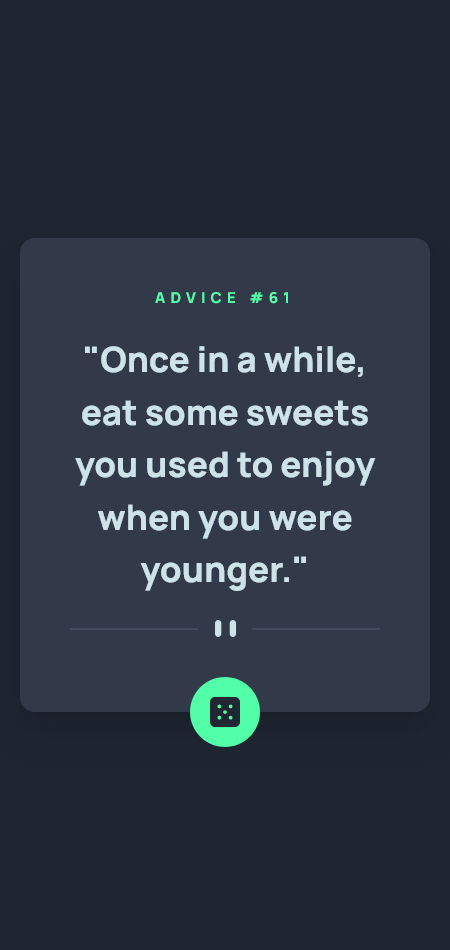

# Frontend Mentor - Advice generator app solution

This is a solution to the [Advice generator app challenge on Frontend Mentor](https://www.frontendmentor.io/challenges/advice-generator-app-QdUG-13db).

## Table of contents

- [Overview](#overview)
  - [The challenge](#the-challenge)
  - [Screenshot](#screenshot)
  - [Links](#links)
- [My process](#my-process)
  - [Built with](#built-with)
  - [What I learned](#what-i-learned)
  - [Continued development](#continued-development)
- [Author](#author)

## Overview

### The challenge

Users should be able to:

- View the optimal layout for the app depending on their device's screen size
- See hover states for all interactive elements on the page
- Generate a new piece of advice by clicking the dice icon

### Screenshot

### Screenshot - Desktop View

### Screenshot - Mobile View

### Links

- Solution URL: [Add solution URL here](https://your-solution-url.com)
- Live Site URL: [Add live site URL here](https://your-live-site-url.com)

## My process

### Built with

- Semantic HTML5 markup
- [Tailwind CSS](https://tailwindcss.com/)
- [React](https://reactjs.org/)
- [Vite](https://vitejs.dev/)
- Desktop-first workflow

### What I learned
- I learned to how to deal with a api when working with React.
- get the advantages of useEffect hook.

### Continued development
- Explore more about tailwind css utility classes, how then can use in configured way.
- Using react with more optimal way.
- deal with more complex api.

## Author

- Website - [Achinthya Dulshan](https://achinthyadulshan.github.io/portfolio/)
- Frontend Mentor - [@AchinthyaDulshan](https://www.frontendmentor.io/profile/AchinthyaDulshan)
- LinkedIn - [Achinthya Dulshan](https://www.linkedin.com/in/achinthya-dulshan-6a0616221/)
- X - [@Achi_Dulshan](https://x.com/Achi_Dulshan)

